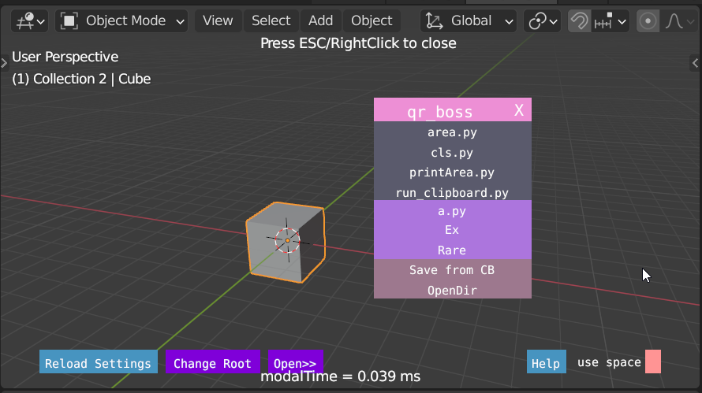

.. _launchers_title:

Launchers (Quick Run)
======================

In order to run python code, that uses BOSS features (eg. creating UI) , there needs to be an operator that inherits from
:ref:`Boss_OT_base_ui  <boss_OT_base_ui_title>`.

In order to save/run/organize python codes, without writing separate addons, one addon/operator can be written.
That operator can load python files dynamically.

Since such an operator is *launching* a script, many launcher scripts can be written. 
I have named my addons `Quick Run <https://gum.co/quick_run>`_ and `Quick Run Free <https://gum.co/qr_free>`_.
These are nothing but operators whose task is loading a python file and running it. It's documented :ref:`here <qr:qr_index>`

.. image:: imgs/qr_free.png
   :width: 45%
   :alt: 'quick run free'

Notes
---------
1. Various kind of Menus, PI menus, file browsers can be written to launch script.
2. These operators will eliminate need for writing addon for small purpose.

